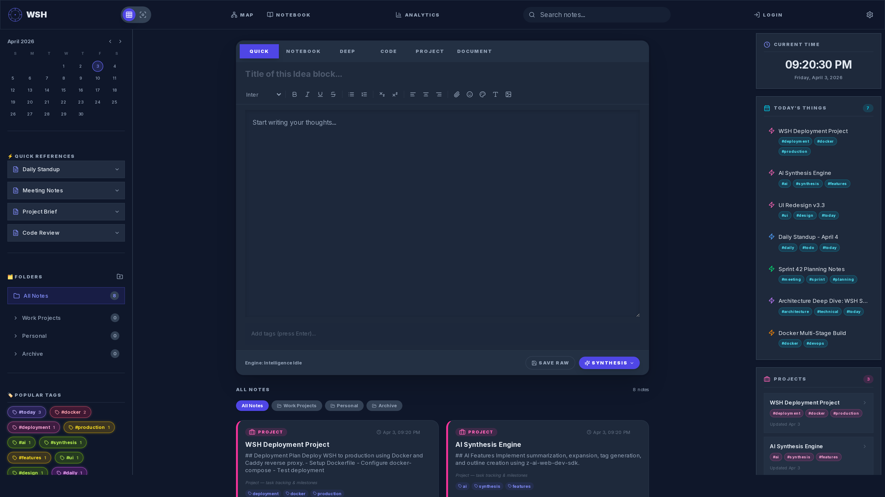
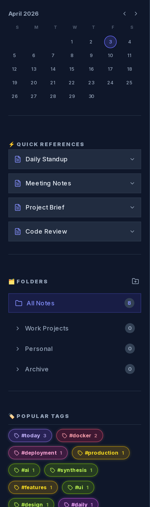
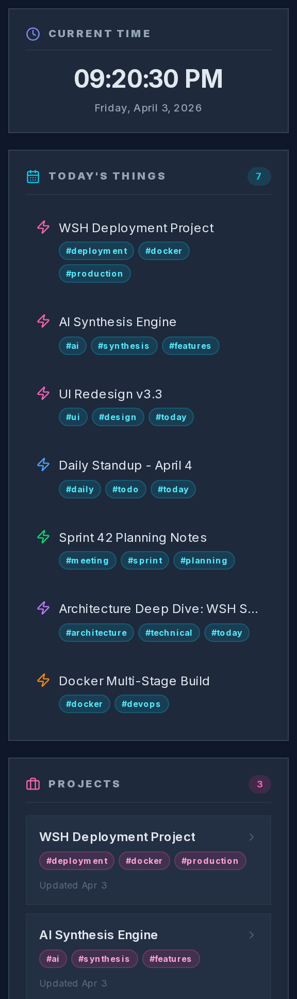
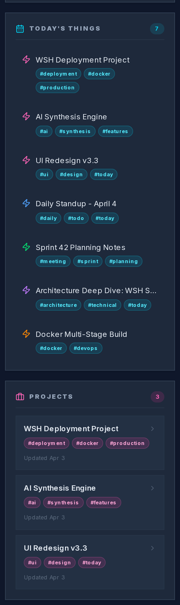
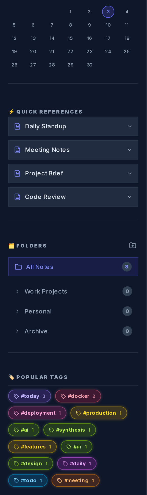
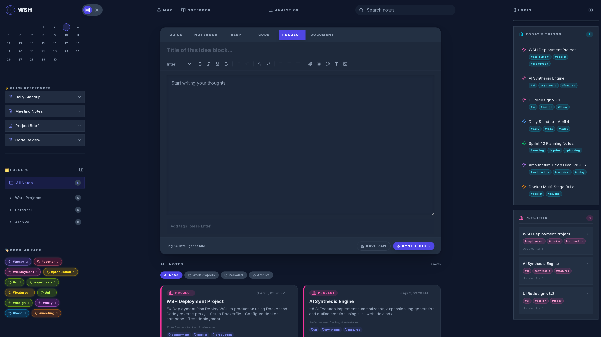
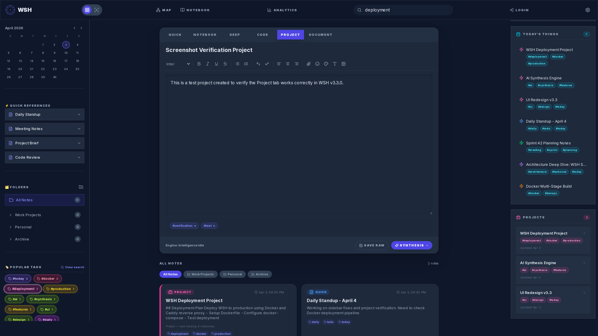

<div align="center">


# WSH — WeaveNote Self-Hosted v3.3.0

**A self-hosted, AI-powered note-taking application with mind mapping, smart synthesis, and a beautiful dark-mode interface.**

Inspired by [WeaveNote](https://weavenote.com), WSH gives you full control over your notes and data — running entirely on your own infrastructure.

[](https://nextjs.org/)
[](https://www.typescriptlang.org/)
[](https://tailwindcss.com/)
[](https://bun.sh/)
[](https://www.docker.com/)
[](LICENSE)

</div>

---

## Table of Contents

- [Overview](#overview)
- [Features](#features)
  - [Mind Map](#-mind-map)
  - [Trash Modal](#-trash-modal)
  - [Notebook View](#-notebook-view)
  - [Note Detail Modal](#-note-detail-modal)
  - [Web DB Viewer](#-web-db-viewer)
  - [Mind Map API](#-mind-map-api)
  - [AlertTriangle ENV Warning](#-alerttriangle-env-warning)
  - [ENV Import/Export](#-env-importexport)
  - [Quick Add Common Keys](#-quick-add-common-keys)
  - [AI Synthesis Engine](#-ai-synthesis-engine)
  - [Admin Panel](#-admin-panel)
  - [Color Themes](#-15-color-themes)
  - [Note Types](#-6-note-types)
  - [Folders & Tags](#-folders--tags)
  - [Authentication](#-user-authentication)
  - [Docker Support](#-docker-support)
  - [Analytics Panel](#-analytics-panel)
  - [Settings Panel](#-settings-panel)
- [Quick Start](#quick-start)
- [Docker Deployment](#docker-deployment)
- [PowerShell Installer](#powershell-installer)
- [Project Structure](#project-structure)
- [API Routes](#api-routes)
- [Environment Variables](#environment-variables)
- [License](#license)

---

## Overview

**WSH (WeaveNote Self-Hosted)** is a feature-rich, self-hosted note-taking application designed for developers, researchers, and teams who value data sovereignty. Built on a modern stack of **Next.js 16**, **TypeScript**, and **Tailwind CSS 4**, WSH provides a sleek, dark-mode-first interface that runs entirely on your own hardware.

At its core, WSH combines powerful note management with an **AI Synthesis Engine** powered by the `z-ai-web-dev-sdk`. The engine supports five intelligent modes — Summarize, Expand, Improve, Generate Tags, and Create Outline — turning raw notes into polished, connected knowledge.

Key design principles:

- **Self-hosted first** — your data never leaves your server
- **Zero external JS dependencies for visualization** — custom SVG force graph without D3.js
- **localStorage persistence** — all application state survives page reloads
- **Role-based access control** — user, admin, and super-admin roles
- **Extensible architecture** — Prisma ORM with SQLite for easy migration to PostgreSQL

---

## Features

### 🧠 Mind Map

A fully interactive **SVG force-directed graph** that visualizes the relationships between your notes in real time. The mind map uses a custom physics simulation engine — no external D3.js dependency required.

**Capabilities:**

- **Physics simulation** — Nodes repel each other while shared-tag edges attract connected notes, creating organic, balanced layouts automatically
- **Node dragging** — Click and drag any node to reposition it; the simulation continues around the pinned node
- **Pan & Zoom** — Click and drag the background to pan; use the zoom controls (or scroll) to zoom in/out from 30% to 300%
- **Tag-based edge connections** — Edges are automatically calculated between notes that share one or more tags, with edge thickness and opacity proportional to the number of shared tags
- **Color-coded by note type** — Each of the 6 note types has a distinct color: Quick (blue), Notebook (green), Deep (purple), Code (orange), Project (pink), Document (cyan)
- **Click-to-edit** — Clicking any node opens that note in the editor and closes the mind map
- **Legend** — A built-in legend in the bottom-left corner shows all note type colors
- **Zoom indicator** — Current zoom percentage displayed in the bottom-right corner
- **Reset view** — One-click button to reset pan and zoom to defaults
- **Node/edge counter** — Header displays the total number of nodes and connections

### 🗑️ Trash Modal

A comprehensive **soft-delete system** that protects you from accidental data loss while keeping your workspace clean.

**Capabilities:**

- **Restore individual notes** — Hover over any trashed note and click "Restore" to move it back to your active notes with a single click
- **Permanent delete** — Remove notes forever with a dedicated delete action (cannot be undone)
- **Empty trash** — One-click button to permanently delete all trashed notes at once
- **AlertTriangle warning** — A prominent warning icon and message alerts you before irreversible actions
- **Deleted count badge** — The trash icon in the footer displays a live count of trashed notes, so you always know how many items are in the trash
- **Soft-delete architecture** — Notes are marked `isDeleted: true` rather than removed from the database, enabling full recovery

### 📖 Notebook View

A distraction-free **linear document reader** that presents all your notes as a continuous, scrollable document — like reading a book.

**Capabilities:**

- **Full-screen reading mode** — Takes over the entire viewport for immersive reading, hiding all sidebar distractions
- **Sidebar navigation** — A compact sidebar lists all notes with their titles, allowing quick jumps between sections
- **Scroll tracking** — The sidebar highlights the currently visible note as you scroll through the document
- **Note pages** — Each note is rendered as a distinct page with a type badge (colored by note type), creation date, tags, and full content
- **Visual separators** — Elegant dividers between notes for clear visual separation
- **Tag display** — All tags associated with each note are shown as small badges beneath the note header

### 📝 Note Detail Modal

A **full-featured note viewer** that displays all metadata and content for any individual note without entering edit mode.

**Capabilities:**

- **Type badge** — Displays the note's type with its corresponding color
- **Creation & updated dates** — Shows when the note was first created and last modified in a clean, formatted layout
- **Content rendering** — Full HTML rendering of the note's processed content with all formatting preserved
- **Raw content preview** — A collapsible section showing the raw markdown/plain-text source of the note
- **Edit action** — One-click button to open the note in the editor for modifications
- **Trash action** — One-click button to move the note to the trash
- **Tag display** — All associated tags shown as interactive badges

### 🌐 Web DB Viewer

A powerful **full-screen database browser** for inspecting and managing your WSH data directly from the web interface.

**Capabilities:**

- **Full-screen database browser** — Dedicated full-viewport overlay for maximum screen real estate
- **Multiple tables** — Browse data across three core tables: Notes, Folders, and Users
- **Search & filter** — Real-time search filtering across all rows and columns
- **Inline editing** — Double-click any cell to edit its value directly in the table (with instant save)
- **Add new rows** — Create new notes, folders, or users directly from the viewer
- **Delete rows** — Remove records with confirmation dialogs
- **Column display** — All database fields are shown as sortable columns
- **Port 5682 access** — Designed to run on a dedicated admin port for secure, separate access

### 🔗 Mind Map API

A RESTful API endpoint that provides the graph data structure consumed by the Mind Map visualization.

**Endpoint:** `GET /api/graph?notes=[...]`

**Capabilities:**

- **Returns nodes and edges** — The response contains a `nodes` array (each with `id`, `title`, `type`, `tags`) and an `edges` array (each with `source`, `target`, `weight`)
- **Tag-based connection calculation** — Automatically computes edges between notes that share one or more tags
- **Edge weighting** — The `weight` field indicates how many tags two notes share (higher = stronger connection)
- **Deleted note filtering** — Automatically excludes soft-deleted notes from the graph data
- **JSON API** — Returns clean, structured JSON for easy integration with any visualization library

### ⚠️ AlertTriangle for ENV Warning Banner

A prominent **security warning banner** displayed in the Admin Panel's ENV Settings section to remind administrators about the dangers of exposing environment variables.

**Capabilities:**

- **Visual warning** — Uses the Lucide `AlertTriangle` icon with amber/yellow styling for high visibility
- **Security message** — Warns administrators to never commit `.env` files to version control or expose them publicly
- **Persistent display** — The warning remains visible whenever the ENV Settings section is active, ensuring it's always noticed

### 💾 ENV Import/Export Buttons

Convenient **file-based management** of your application's environment configuration directly from the Admin Panel.

**Capabilities:**

- **Import .env files** — Upload a `.env` file from your local machine to load environment variables into the admin interface
- **Export current config** — Download all currently configured environment variables as a `.env` file
- **File download** — Exported files are automatically downloaded to your default downloads folder
- **Format preservation** — Both import and export use the standard `KEY=VALUE` format

### ➕ Quick Add Common Keys

One-click **preset buttons** that instantly add the most commonly used environment variables to the Admin Panel's ENV configuration.

**Capabilities:**

- **Pre-configured keys** — Buttons for `PORT`, `APP_NAME`, `STORAGE_TYPE`, `BACKUP_INTERVAL`, `LOG_LEVEL`, and `MAX_UPLOAD_SIZE`
- **Default values** — Each preset comes with a sensible default value that you can modify after adding
- **Duplicate prevention** — Existing keys are not added again
- **Bulk configuration** — Quickly set up a complete environment configuration in seconds

### 🤖 AI Synthesis Engine

An intelligent **text processing engine** powered by the `z-ai-web-dev-sdk` that transforms your notes using five distinct AI modes.

**Modes:**

| Mode | Description |
|------|-------------|
| **Summarize** | Condenses note content into a concise summary while preserving key information |
| **Expand** | Enriches notes with additional detail, examples, and contextual information |
| **Improve** | Enhances writing quality by fixing grammar, improving clarity, and refining style |
| **Generate Tags** | Analyzes content and suggests relevant tags as a JSON array |
| **Create Outline** | Generates a structured hierarchical outline from the note's content |

**Capabilities:**

- **z-ai-web-dev-sdk integration** — Uses the GLM-4-Flash model (configurable) via the z-ai-web-dev-sdk package
- **Daily usage limit** — Enforces a configurable daily limit (default: 800 requests/day) with automatic counter reset at midnight
- **Configurable parameters** — Model name, temperature, and max tokens are all configurable via environment variables
- **Rate limiting** — Returns HTTP 429 when the daily limit is exceeded
- **Usage tracking** — Each response includes `tokensUsed` and `usageCount` for monitoring

### 🛡️ Admin Panel

A comprehensive **system administration dashboard** with six distinct sections for managing every aspect of your WSH instance.

**Sections:**

1. **ENV Settings** — View, edit, import, and export environment variables with security warnings and quick-add presets
2. **Versioning** — View current application version, build information, and update history
3. **User Base** — Manage users, assign roles, view activity, and handle account status
4. **Cloud Setup** — Configure cloud backup, remote storage, and deployment settings
5. **DB Viewer** — Launch the full-screen Web DB Viewer for direct database inspection
6. **System Logs** — View real-time and historical application logs for debugging and monitoring

**Capabilities:**

- **Role-based access** — Only users with `admin` or `super-admin` roles can access the panel
- **Tabbed navigation** — Clean tab-based UI for switching between sections
- **Responsive design** — Fully functional on both desktop and tablet screen sizes

### 🎨 15 Color Themes

WSH ships with **15 hand-crafted color themes** that transform the entire application's look and feel with a single click.

| Theme | Mood |
|-------|------|
| **Default** | Clean, neutral dark mode |
| **Ocean** | Deep blues and teals |
| **Forest** | Rich greens and earth tones |
| **Sunset** | Warm oranges and reds |
| **Rose** | Soft pinks and blush tones |
| **Midnight** | Deep navy and charcoal |
| **Coffee** | Warm browns and cream |
| **Neon** | Vibrant electric colors on dark |
| **Cyberpunk** | Futuristic magentas and cyans |
| **Nord** | Cool arctic blues and grays |
| **Dracula** | Iconic purple-toned dark theme |
| **Lavender** | Soft purples and gentle gradients |
| **Earth** | Natural greens, browns, and sand |
| **Yellow** | Warm golden tones |
| **Hyperblue** | Intense electric blue |

**Capabilities:**

- **Instant switching** — Theme changes apply immediately without page reload
- **Persistent selection** — Your chosen theme is saved to `localStorage` and restored on next visit
- **Full coverage** — Themes affect all components, cards, badges, backgrounds, and borders

### 📝 6 Note Types

WSH supports **six distinct note types**, each with its own colored badge, description, and visual treatment.

| Type | Color | Description |
|------|-------|-------------|
| **Quick** | Blue | Short, rapid notes for capturing thoughts, ideas, and reminders on the fly |
| **Notebook** | Green | Medium-length notes organized into sections, ideal for meeting notes and daily journals |
| **Deep** | Purple | Long-form, research-grade notes with detailed analysis, citations, and comprehensive content |
| **Code** | Orange | Technical notes with code snippets, configuration files, and development documentation |
| **Project** | Pink | Project planning notes with tasks, milestones, timelines, and deliverables |
| **Document** | Cyan | Formal documents, reports, and structured writing with distinct left-border styling |

**Capabilities:**

- **Colored badges** — Each type displays a uniquely colored badge on every note card
- **Type filtering** — Filter your notes grid by type to focus on specific categories
- **Distinct descriptions** — The Note Editor displays a unique description for each type when selected

### 📂 Folders & Tags

A flexible **organizational system** combining hierarchical folders with flat tag-based categorization.

**Capabilities:**

- **Folder creation and management** — Create, rename, reorder, and delete folders to organize notes hierarchically
- **Drag-and-drop** — Reorder folders with drag-and-drop using `@dnd-kit`
- **Tag management** — Add, remove, and filter by tags on any note
- **Multi-tag support** — Each note can have multiple tags for cross-cutting categorization
- **Folder filtering** — Click a folder in the sidebar to filter the notes grid to that folder's contents
- **Tag filtering** — Click a tag to see all notes sharing that tag across folders (neon-colored tags with glow effects)
- **Searchable tags** — Click any tag in the sidebar to instantly filter the notes grid; click again to clear

### 🔐 User Authentication

A secure **authentication system** with role-based access control for multi-user deployments.

**Capabilities:**

- **Login/registration** — Built-in login widget with username, email, and password fields
- **Role-based access** — Three roles with escalating permissions:
  - `user` — Standard access to personal notes and basic features
  - `admin` — Access to the Admin Panel and user management
  - `super-admin` — Full system access including ENV settings and system logs
- **JWT tokens** — Secure token-based authentication
- **Status management** — User accounts can be set to `active` or `suspended` status

### 🐳 Docker Support

WSH includes a production-ready **Docker configuration** for easy deployment on any server or cloud platform.

**Capabilities:**

- **Multi-stage Dockerfile** — Three-stage build (deps → builder → runner) for minimal image size
- **Non-root execution** — Runs as the `nextjs` user (UID 1001) for security
- **Health checks** — Built-in health check hitting `/api/health` every 30 seconds
- **Volume persistence** — SQLite database stored in a named Docker volume (`wsh-data`) for data persistence across container restarts
- **Auto-restart** — Configured with `restart: unless-stopped` for high availability
- **Configurable environment** — All settings configurable via `docker-compose.yml` environment variables

### 📊 Analytics Panel

A visual **statistics dashboard** showing insights into your note-taking habits and data.

**Capabilities:**

- **Note statistics** — Total notes, notes by type, notes by folder
- **Activity tracking** — Creation trends, update frequency
- **Tag analytics** — Most used tags, tag distribution
- **Visual charts** — Powered by Recharts for beautiful, interactive data visualization

### ⚙️ Settings Panel

A central **configuration panel** for personalizing your WSH experience.

**Capabilities:**

- **Dark/light mode toggle** — Switch between dark and light themes with a single click
- **Theme selection** — Choose from all 15 color themes
- **View mode** — Toggle between grid and focus view modes
- **Preferences** — Configure editor behavior, default note type, and other personal settings

---

## Quick Start

### Prerequisites

- [Node.js](https://nodejs.org/) 20+ or [Bun](https://bun.sh/) 1.0+
- [SQLite](https://sqlite.org/) (included via Prisma)

### Installation

```bash
# Clone the repository
git clone https://github.com/your-org/wsh.git
cd wsh

# Install dependencies
bun install

# Set up the database
bun run db:generate
bun run db:push

# Create your .env file
cp .env.example .env
# Edit .env with your configuration

# Start the development server
bun run dev
```

Open [http://localhost:3000](http://localhost:3000) in your browser.

### Production Build

```bash
# Build for production
bun run build

# Start the production server
bun run start
```

---

## Docker Deployment

The fastest way to deploy WSH is with Docker Compose:

```bash
# Clone and configure
git clone https://github.com/your-org/wsh.git
cd wsh

# Edit environment variables
cp .env.example .env
nano .env  # Set JWT_SECRET, ADMIN_DEFAULT_PASSWORD, etc.

# Start the service
docker compose up -d

# View logs
docker compose logs -f wsh
```

The application will be available at [http://localhost:3000](http://localhost:3000).

### Docker Configuration

The `docker-compose.yml` includes:

- **Health checks** — Automatic container health monitoring via `/api/health`
- **Persistent storage** — SQLite database stored in the `wsh-data` Docker volume
- **Environment passthrough** — All configuration via environment variables
- **Auto-restart** — Container automatically restarts on failure

---

## PowerShell Installer

For Windows users, WSH includes a PowerShell installer script:

```powershell
# Download and run the installer
.\install-wsh.ps1
```

The script will:

1. Check for required dependencies (Node.js/Bun, Docker)
2. Clone the repository
3. Install dependencies
4. Set up the database
5. Configure environment variables
6. Start the application

---

## Project Structure

```
wsh/
├── public/
│   ├── logo.svg              # WSH application logo
│   └── robots.txt            # Search engine directives
├── src/
│   ├── app/
│   │   ├── globals.css       # Global styles and theme definitions
│   │   ├── layout.tsx        # Root layout with providers
│   │   ├── page.tsx          # Main application page
│   │   └── api/
│   │       ├── health/       # Health check endpoint
│   │       ├── synthesis/    # AI synthesis endpoint
│   │       ├── graph/        # Mind map graph data endpoint
│   │       └── admin/
│   │           ├── env/      # ENV settings management
│   │           ├── users/    # User management
│   │           ├── system/   # System information
│   │           └── logs/     # System logs
│   ├── components/
│   │   ├── ui/               # shadcn/ui base components
│   │   └── wsh/              # WSH application components
│   │       ├── MindMap.tsx       # SVG force-directed graph
│   │       ├── TrashModal.tsx    # Soft-delete/restore modal
│   │       ├── NotebookView.tsx  # Linear document reader
│   │       ├── NoteDetailModal.tsx # Individual note viewer
│   │       ├── DBViewer.tsx      # Full-screen database browser
│   │       ├── AdminPanel.tsx    # Admin dashboard
│   │       ├── NoteEditor.tsx    # Rich text note editor
│   │       ├── NotesGrid.tsx     # Notes grid display
│   │       ├── Folders.tsx       # Folder management
│   │       ├── Tags.tsx          # Tag management
│   │       ├── AnalyticsPanel.tsx # Statistics dashboard
│   │       ├── SettingsPanel.tsx  # Settings & preferences
│   │       ├── LoginWidget.tsx    # Authentication UI
│   │       ├── Header.tsx         # Application header
│   │       ├── Footer.tsx         # Application footer
│   │       ├── LeftSidebar.tsx    # Calendar, Folders, Tags
│   │       ├── RightSidebar.tsx   # Live Clock, Today's Things, Projects
│   │       ├── Calendar.tsx       # Compact calendar view
│   │       ├── QuickReferences.tsx # Template quick access
│   │       ├── FarRightSidebar.tsx # Legacy (content merged into RightSidebar)
│   │       └── Logo.tsx           # WSH logo component
│   ├── hooks/
│   │   ├── use-toast.ts      # Toast notification hook
│   │   └── use-mobile.ts     # Mobile detection hook
│   ├── lib/
│   │   ├── db.ts             # Prisma database client
│   │   └── utils.ts          # Utility functions
│   └── store/
│       └── wshStore.ts       # Zustand global state store
├── prisma/
│   └── schema.prisma         # Database schema (SQLite)
├── db/
│   └── custom.db             # SQLite database file
├── docker-compose.yml        # Docker Compose configuration
├── Dockerfile                # Multi-stage Docker build
├── Caddyfile                 # Caddy reverse proxy config
├── next.config.ts            # Next.js configuration
├── tailwind.config.ts        # Tailwind CSS configuration
├── tsconfig.json             # TypeScript configuration
├── package.json              # Dependencies and scripts
└── install-wsh.ps1           # PowerShell installer script
```

---

## API Routes

### `GET /api/health`

Health check endpoint. Returns the application status, version, and current timestamp.

```json
{ "status": "healthy", "version": "3.3.0", "timestamp": "2026-04-04T12:00:00.000Z" }
```

### `POST /api/synthesis`

AI synthesis endpoint for processing note content through five modes.

**Request body:**
```json
{ "content": "Your note content here...", "action": "summarize" }
```

**Valid actions:** `summarize`, `expand`, `improve`, `tags`, `outline`

**Response:**
```json
{ "result": "AI-generated content...", "tokensUsed": 245, "usageCount": 1 }
```

**Rate limit:** Returns HTTP 429 when the daily limit (default: 800) is exceeded.

### `GET /api/graph?notes=[...]`

Mind Map graph data endpoint. Returns nodes and edges calculated from shared tags.

**Query parameter:** `notes` — URL-encoded JSON array of note objects

**Response:**
```json
{
  "nodes": [
    { "id": "...", "title": "Note Title", "type": "quick", "tags": ["tag1", "tag2"] }
  ],
  "edges": [
    { "source": "id1", "target": "id2", "weight": 2 }
  ]
}
```

### `GET|POST /api/admin/env`

Admin endpoint for reading and writing environment variable configuration.

### `GET /api/admin/system`

Admin endpoint for retrieving system information (version, uptime, resource usage).

### `GET|POST /api/admin/users`

Admin endpoint for user management (list, create, update roles, suspend accounts).

### `GET /api/admin/logs`

Admin endpoint for retrieving application logs (filterable by level and time range).

---

## Environment Variables

| Variable | Default | Description |
|----------|---------|-------------|
| `PORT` | `3000` | Application listening port |
| `HOSTNAME` | `0.0.0.0` | Application bind address |
| `DATABASE_URL` | `file:/app/db/custom.db` | SQLite database connection string |
| `JWT_SECRET` | `change-me-in-production` | Secret key for JWT token signing (**change in production!**) |
| `ADMIN_DEFAULT_USERNAME` | `admin` | Default admin username on first run |
| `ADMIN_DEFAULT_EMAIL` | `admin@wsh.local` | Default admin email on first run |
| `ADMIN_DEFAULT_PASSWORD` | `admin123` | Default admin password on first run (**change immediately!**) |
| `AI_SYNTHESIS_MODEL` | `glm-4-flash` | AI model used for synthesis operations |
| `AI_SYNTHESIS_TEMPERATURE` | `0.7` | AI response creativity (0.0–1.0) |
| `AI_SYNTHESIS_MAX_TOKENS` | `4096` | Maximum tokens per AI response |
| `AI_DAILY_LIMIT` | `800` | Maximum AI synthesis requests per day |
| `APP_NAME` | `WSH` | Application display name |
| `STORAGE_TYPE` | `local` | Storage backend type (`local` or `cloud`) |
| `BACKUP_INTERVAL` | `24h` | Automatic backup interval |
| `LOG_LEVEL` | `info` | Application log verbosity (`debug`, `info`, `warn`, `error`) |
| `MAX_UPLOAD_SIZE` | `10mb` | Maximum file upload size |

---

## Tech Stack

| Category | Technology |
|----------|-----------|
| Framework | Next.js 16 (App Router) |
| Language | TypeScript 5 |
| Styling | Tailwind CSS 4 |
| UI Components | shadcn/ui + Radix UI |
| State Management | Zustand 5 |
| Database | SQLite via Prisma ORM |
| AI Integration | z-ai-web-dev-sdk |
| Charts | Recharts |
| Animations | Framer Motion |
| Icons | Lucide React |
| Drag & Drop | @dnd-kit |
| Runtime | Bun / Node.js |
| Containerization | Docker + Docker Compose |
| Reverse Proxy | Caddy (optional) |

---

## Screenshots

| View | Description |
|------|-------------|
|  | **3-Column Layout** — Left sidebar (Calendar, Folders, Tags) + Main Content + Right sidebar (Clock, Today's Things, Projects) |
|  | **Left Sidebar** — Calendar, Quick References, Folders |
|  | **Right Sidebar** — Live Clock, Today's Things |
|  | **Projects** — All project-type notes listed in right sidebar |
|  | **Neon Tags** — Clickable tags with search filtering |
|  | **Project Tab** — Selected in the note editor |
|  | **Tag Search** — Clicking #deployment filters notes |
|  | **Notes Grid** — Project cards with pink border |

---

## License

This project is licensed under the **MIT License**.

```
MIT License

Copyright (c) 2025 WSH Contributors

Permission is hereby granted, free of charge, to any person obtaining a copy
of this software and associated documentation files (the "Software"), to deal
in the Software without restriction, including without limitation the rights
to use, copy, modify, merge, publish, distribute, sublicense, and/or sell
copies of the Software, and to permit persons to whom the Software is
furnished to do so, subject to the following conditions:

The above copyright notice and this permission notice shall be included in all
copies or substantial portions of the Software.

THE SOFTWARE IS PROVIDED "AS IS", WITHOUT WARRANTY OF ANY KIND, EXPRESS OR
IMPLIED, INCLUDING BUT NOT LIMITED TO THE WARRANTIES OF MERCHANTABILITY,
FITNESS FOR A PARTICULAR PURPOSE AND NONINFRINGEMENT.
```

---

<div align="center">

**Built with ❤️ by the WSH Contributors**

</div>
